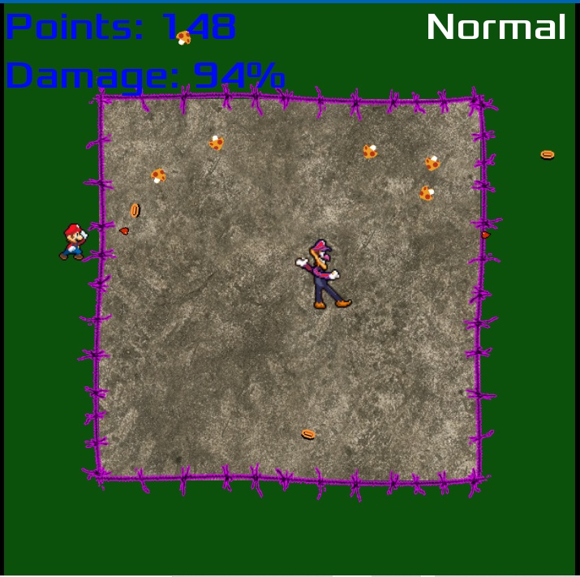
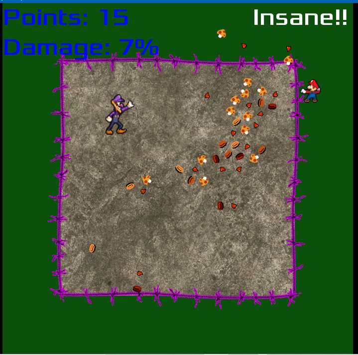

# Waluigi Submission #1

Mario is throwing coins and such at Waluigi. Avoid them or bash them or don't. It doesn't matter, eventually the game will end.

## Screenshots

## Copying

`audio/House In a Forest Loop.ogg` Copyright &copy; 2012 [HorrorPen](https://opengameart.org/users/horrorpen), [CC-BY 3.0: Attribution](http://creativecommons.org/licenses/by/3.0/). Source: https://opengameart.org/content/loop-house-in-a-forest

Mario and Waluigi sprite sheets are used with special permission from Super Mario Bros: Heroes of the Stars, by Fredrik Nilsson, aka AsylusGoji91. Source: https://www.deviantart.com/asylusgoji91

Font is "Xolonium". Copyright &copy; 2011-2016 Severin Meyer <sev.ch@web.de>, with Reserved Font Name Xolonium, SIL open font license version 1.1. Details are in `fonts/LICENSE.txt`.

Barbed wire image has been modified to be more purple. Original version by James White. [CC0 1.0 Universal](http://creativecommons.org/publicdomain/zero/1.0/). Purple version under same license. Original source: https://opengameart.org/content/barbed-wire

Concrete floor image from Rob Tuytel of texturehaven.com. [CC0 1.0 Universal](http://creativecommons.org/publicdomain/zero/1.0/) Source: https://www.texturehaven.com/tex/?c=concrete&t=concrete_floor_02

Animated coin sprite sheet and hearts and mushroom and all sound effects from Nintendo(R) games.

Finally, I've used code from the Godot tutorial project, Dodge the Creeps. MIT Licensed. Details in LICENSE.txt.
